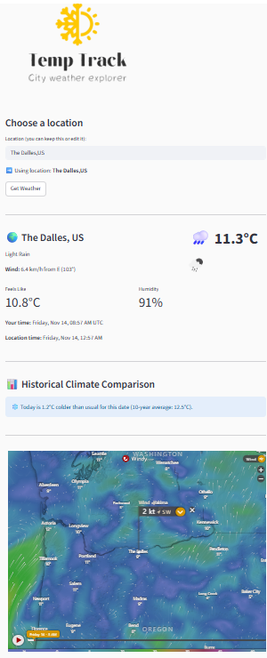

# 🌡️ TempTrack – Simple Weather App

## TempTrack is a small Streamlit app that shows the current weather for any city.
## It includes basic conditions, maps, and a day-to-day temperature comparison.

## 👉 Live app:
https://weather-app-project-temptrack.streamlit.app/

## Features

- Current temperature, humidity, wind, and weather description

- Local time and the time in the selected location

- Auto-detects your city when possible

- Location map, wind map, and radar view

- 10-year average temperature comparison for today

- Saves your last used location and units (°C / °F)

## Project Structure

streamlit_app.py     # Main application
logo.png             # Logo shown in the app
settings.json        # Stored user preferences
requirements.txt     # Dependencies

## Run Locally
pip install -r requirements.txt
streamlit run streamlit_app.py

## Requirements
streamlit
requests
python-dateutil
folium
streamlit-folium
